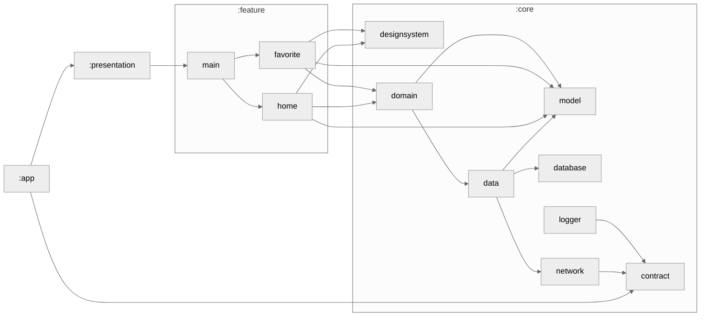

## Project environment

- Gradle: 8.10.2
- Kotlin : 2.0.20
- KSP : 2.0.20-1.0.25
- AGP : 8.6.1

> Android Studio - Ladybug | 2024.1.3 Canary 2 에서 작성 되었습니다.

### Dependency Diagram

```mermaid
%%{
  init: {
    'theme': 'neutral'
  }
}%%

graph LR
  subgraph :core
    :core:contract["contract"]
    :core:data["data"]
    :core:model["model"]
    :core:database["database"]
    :core:network["network"]
    :core:designsystem["designsystem"]
    :core:domain["domain"]
    :core:logger["logger"]
  end
  subgraph :feature
    :feature:main["main"]
    :feature:home["home"]
    :feature:favorite["favorite"]
  end
  :app --> :core:contract
  :app --> :presentation
  :presentation --> :feature:main
  :core:data --> :core:model
  :core:data --> :core:database
  :core:data --> :core:network
  :feature:home --> :core:designsystem
  :feature:home --> :core:model
  :feature:home --> :core:domain
  :core:network --> :core:contract
  :feature:favorite --> :core:designsystem
  :feature:favorite --> :core:model
  :feature:favorite --> :core:domain
  :core:logger --> :core:contract
  :core:domain --> :core:model
  :core:domain --> :core:data
  :feature:main --> :feature:home
  :feature:main --> :feature:favorite
```